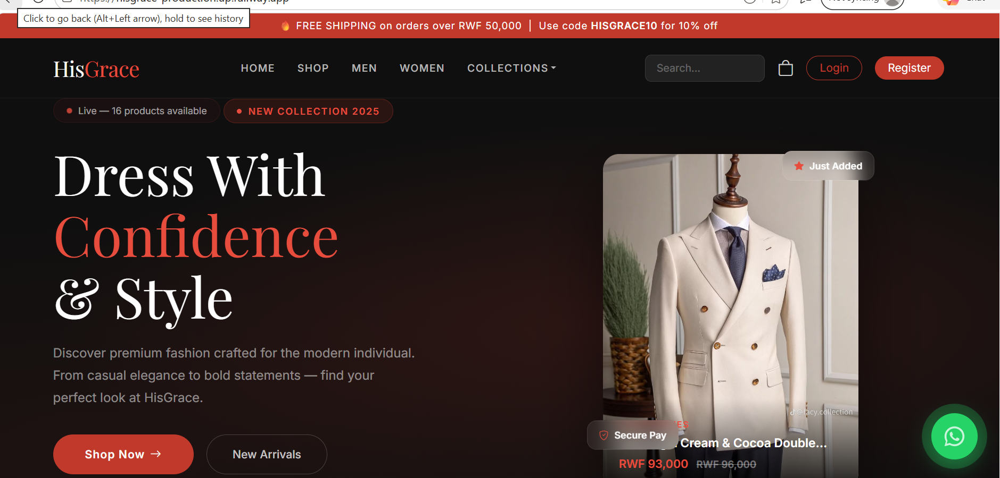
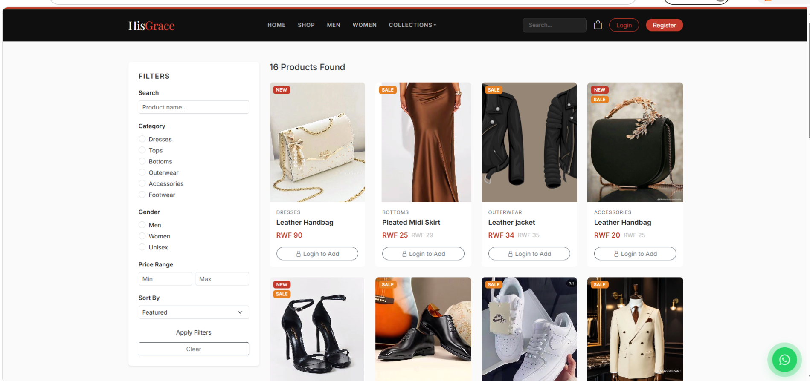
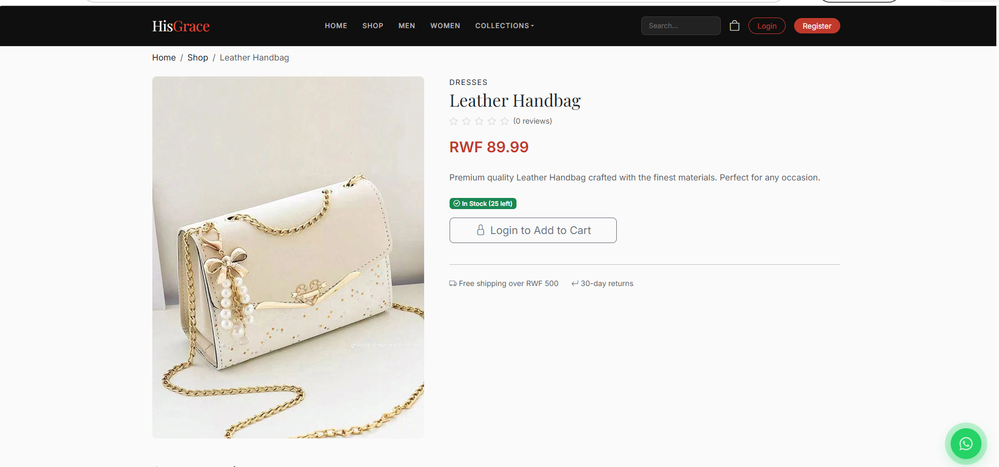
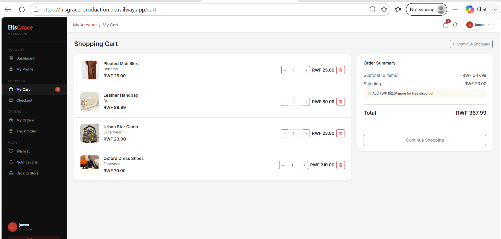
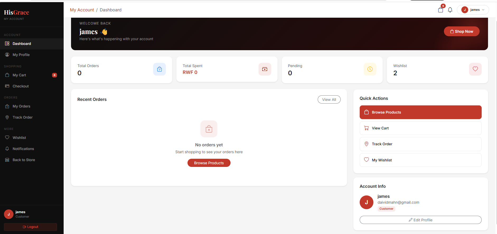
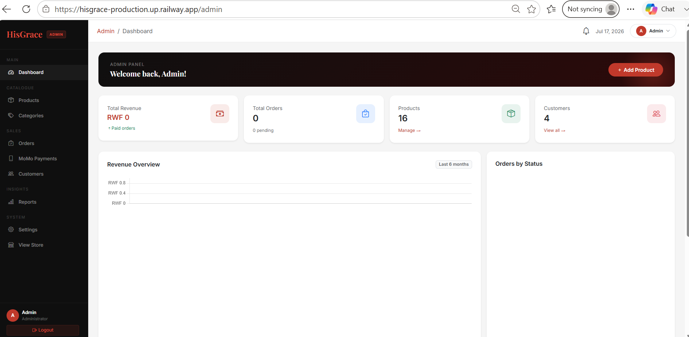
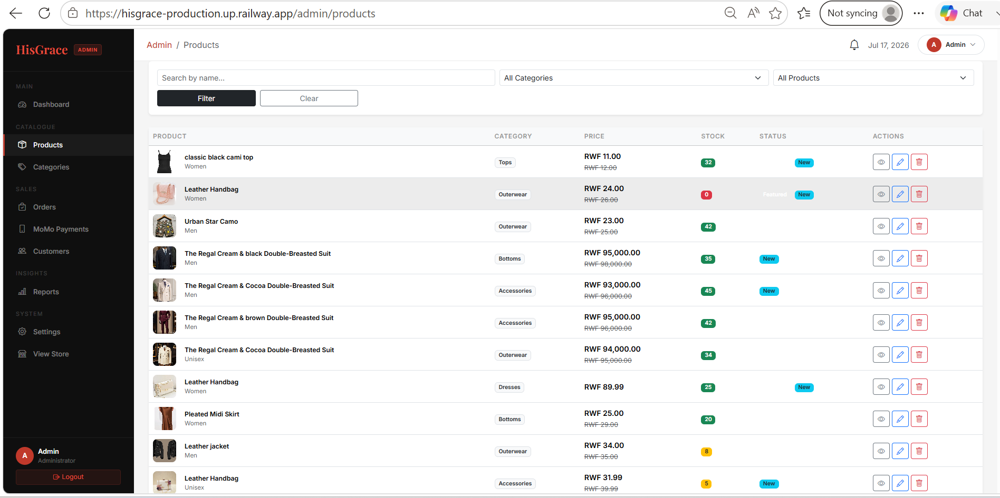
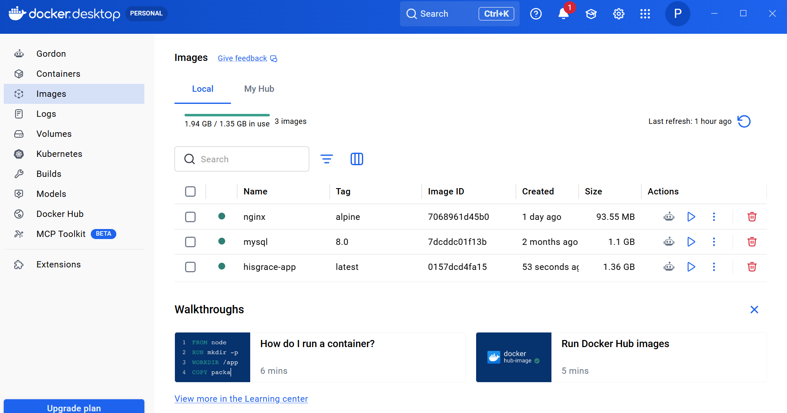
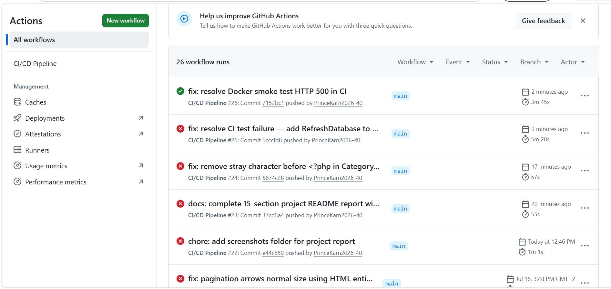

# HisGrace Fashion Store — E-Commerce Web Application

<p align="center">
  
  
  
  
  
  
</p>

**Student:** Prince Karn
**Course:** EWA408510 – E-Commerce and Web Application
**Institution:** Faculty of Computing and Information Sciences — UNILAK
**Academic Year:** 2025–2026

---

## Table of Contents

1. [Introduction](#1-introduction)
2. [Problem Statement](#2-problem-statement)
3. [Project Objectives](#3-project-objectives)
4. [System Features](#4-system-features)
5. [Technologies Used](#5-technologies-used)
6. [System Architecture](#6-system-architecture)
7. [Database Design](#7-database-design)
8. [Screenshots of the Application](#8-screenshots-of-the-application)
9. [GitHub Repository Link](#9-github-repository-link)
10. [Deployment Link](#10-deployment-link)
11. [CI/CD Implementation](#11-cicd-implementation)
12. [Docker Implementation](#12-docker-implementation)
13. [Challenges Encountered](#13-challenges-encountered)
14. [Future Enhancements](#14-future-enhancements)
15. [Conclusion](#15-conclusion)

---

## 1. Introduction

HisGrace Fashion Store is a full-featured e-commerce web application designed and built for a Rwandan fashion retail brand. The platform enables customers to browse and purchase clothing and fashion accessories online through a modern, responsive interface. Built on **Laravel 12** with a **MySQL** backend, the application provides separate experiences for customers and administrators, supporting the full online shopping lifecycle from product discovery to order fulfillment.

The project was developed as part of the EWA408510 course requirement and demonstrates practical integration of modern web development, DevOps, and deployment practices including Docker containerization, CI/CD automation via GitHub Actions, and cloud deployment on Railway.

---

## 2. Problem Statement

Local fashion businesses in Rwanda traditionally rely on physical storefronts, limiting their reach to walk-in customers and restricting sales to business hours. There is no scalable, affordable mechanism to reach customers across the country or showcase a full product catalog online. Manual order management leads to errors, poor customer experience, and lost revenue.

Additionally, the lack of an online platform means businesses cannot offer features that modern shoppers expect, such as order tracking, account management, product reviews, or wishlist functionality. This project addresses those gaps by delivering a complete, deployable e-commerce solution tailored to the Rwandan market, including local payment support (MTN MoMo).

---

## 3. Project Objectives

The primary objectives of this project are:

- **Build a responsive e-commerce storefront** that allows customers to browse, search, and filter fashion products by category, gender, and price range.
- **Implement a full shopping cart and checkout flow** including order summary, customer information collection, form validation, and order confirmation.
- **Provide an admin dashboard** with full CRUD capabilities for products, categories, orders, customers, and payments.
- **Integrate local payment support** through MTN Mobile Money (MoMo) with a manual payment confirmation workflow.
- **Implement secure authentication** via Laravel Jetstream (email/password) and Google OAuth through Laravel Socialite.
- **Containerize the application** using Docker and Docker Compose for consistent, reproducible deployments.
- **Automate build, test, and deployment** through a GitHub Actions CI/CD pipeline.
- **Deploy to a live, publicly accessible URL** on the Railway cloud platform.
- **Maintain a clean GitHub repository** with meaningful commit history and complete documentation.

---

## 4. System Features

### 4.1 Storefront & Product Discovery
- Animated hero section with a live product carousel/slider
- Product listing page with category cards and featured product grids
- Product detail page showing images, description, size, price, and customer reviews
- Search and filtering by category, gender, price range, and sort order
- "Coming Soon" products with countdown timers
- WhatsApp floating action button for direct customer support

### 4.2 Shopping Cart
- Cart accessible to both guests and authenticated users
- Add, remove, and update product quantities
- Automatic total calculation including item subtotals
- Cart persists for authenticated users across sessions

### 4.3 Checkout & Payments
- Multi-step checkout form collecting full shipping details
- Order summary review before confirmation
- MTN MoMo payment integration with manual confirmation flow
- Payment status lifecycle: Pending → Confirmed → Failed
- Order confirmation page with order number and email notification

### 4.4 Authentication & Security
- Email/password registration and login via Laravel Jetstream + Fortify
- Google OAuth single sign-on via Laravel Socialite
- Email verification enforcement
- Two-factor authentication (TOTP)
- Passkeys/WebAuthn support
- Password reset via email (Fortify)
- CSRF protection on all forms, input validation throughout
- Admin middleware protecting all `/admin` routes
- SQL injection prevention via Eloquent ORM parameterized queries
- Password hashing with bcrypt (12 rounds)
- HTTPS enforced in production

### 4.5 Customer Dashboard
- Welcome banner with personalized stats (orders, wishlist items, cart count)
- Full order history with individual order detail views
- Order tracking by order number
- Profile management (name, email, avatar)
- Notifications center (read/unread)
- Wishlist management

### 4.6 Admin Panel
- Dashboard with Chart.js revenue graphs and order status breakdown
- Product CRUD — create, edit, delete with image upload and URL support
- Category management (CRUD)
- Order management with status update controls (pending, processing, shipped, delivered)
- Customer management — full CRUD, profile view, account suspend/activate toggle
- Payment management with status update controls
- Reports page
- Settings page

---

## 5. Technologies Used

| Layer | Technology | Version |
|---|---|---|
| Backend Framework | Laravel | 12.x |
| Language | PHP | 8.2+ |
| Authentication | Laravel Jetstream + Fortify + Sanctum | 5.x / 4.x |
| OAuth | Laravel Socialite (Google) | 5.28 |
| Realtime UI | Livewire | 3.6+ |
| Frontend CSS | Bootstrap | 5.3.3 |
| Icons | Bootstrap Icons | Latest |
| Charts | Chart.js | Latest |
| Fonts | Playfair Display, Inter (Google Fonts) | — |
| Build Tool | Vite | Latest |
| Database | MySQL | 8.0 |
| ORM | Eloquent (Laravel) | — |
| Testing | PHPUnit | 11.x |
| Containerization | Docker + Docker Compose | Latest |
| Web Server (Docker) | Nginx (Alpine) | Latest |
| CI/CD | GitHub Actions | — |
| Deployment Platform | Railway | — |
| File Storage | Laravel Storage (public disk) / Cloudinary | — |
| Notifications | Laravel Database Notifications | — |
| Payment | MTN MoMo (manual confirmation) | — |

---

## 6. System Architecture

HisGrace follows the **MVC (Model-View-Controller)** architectural pattern provided by Laravel, with clear separation of concerns across layers.

```
┌──────────────────────────────────────────────────────────────────┐
│                         Browser / Client                         │
└────────────────────────────┬─────────────────────────────────────┘
                             │ HTTP/HTTPS
┌────────────────────────────▼─────────────────────────────────────┐
│                     Nginx Web Server                             │
│               (reverse proxy to PHP-FPM)                        │
└────────────────────────────┬─────────────────────────────────────┘
                             │
┌────────────────────────────▼─────────────────────────────────────┐
│                  Laravel Application (PHP-FPM)                   │
│                                                                  │
│  ┌─────────────┐   ┌──────────────────┐   ┌──────────────────┐  │
│  │   Routes    │──▶│   Controllers    │──▶│     Models       │  │
│  │  web.php    │   │  Admin/          │   │  Product         │  │
│  └─────────────┘   │  CartController  │   │  Order           │  │
│                    │  CheckoutCtrl    │   │  User            │  │
│  ┌─────────────┐   │  CustomerCtrl   │   │  Cart            │  │
│  │  Middleware │   │  OrderController │   │  Wishlist        │  │
│  │  Admin      │   │  ShopController  │   │  Review          │  │
│  │  Auth       │   │  ReviewCtrl      │   │  Payment         │  │
│  └─────────────┘   │  WishlistCtrl    │   └────────┬─────────┘  │
│                    │  SocialAuthCtrl  │            │             │
│                    └────────┬─────────┘            │             │
│                             │                      │             │
│  ┌──────────────────────────▼──────────────────────▼──────────┐  │
│  │                    Blade Views                              │  │
│  │   shop/  admin/  customer/  auth/  layouts/  emails/       │  │
│  └─────────────────────────────────────────────────────────────┘  │
└────────────────────────────┬─────────────────────────────────────┘
                             │
┌────────────────────────────▼─────────────────────────────────────┐
│                      MySQL 8.0 Database                          │
└──────────────────────────────────────────────────────────────────┘
```

**Key architectural decisions:**
- **Middleware layers** — `admin` middleware gates all `/admin` routes; `auth:sanctum` gates all authenticated user routes.
- **Guest + Auth cart** — Cart operations are available to unauthenticated users (view/update/remove); adding to cart requires authentication.
- **Route-model binding** — Products are resolved by slug (`{product:slug}`) for clean SEO-friendly URLs.
- **Notifications** — Laravel Database Notifications store and display alerts for order updates in the customer dashboard.
- **Docker services** — Three-container stack: `app` (PHP-FPM), `nginx` (web server), `db` (MySQL), networked via `hisgrace_network`.

---

## 7. Database Design

The application uses **MySQL 8.0** with the following relational schema managed through Laravel migrations.

### Entity Relationship Overview

```
users ──────────────────┐
  │                     │
  ├──< orders >──< order_items >──< products >──< categories
  ├──< carts >──────────────────────▲
  ├──< wishlists >──────────────────▲
  ├──< reviews >────────────────────▲
  └──< payments (via orders)
```

### Tables

| Table | Key Columns | Description |
|---|---|---|
| `users` | id, name, email, password, is_admin, profile_photo_path, google_id | Customers and admins |
| `categories` | id, name, slug, description, image | Product categories |
| `products` | id, category_id, name, slug, description, price, stock, image, gender, is_featured, is_coming_soon | Product listings |
| `orders` | id, user_id, order_number, status, subtotal, shipping_fee, total, shipping_address, payment_method | Customer orders |
| `order_items` | id, order_id, product_id, quantity, price | Line items per order |
| `carts` | id, user_id, session_id, product_id, quantity | Shopping cart (guest + auth) |
| `wishlists` | id, user_id, product_id | Saved products per user |
| `reviews` | id, user_id, product_id, rating, comment | Product reviews and star ratings |
| `payments` | id, order_id, user_id, amount, method, status, reference, confirmed_at | Payment records |
| `sessions` | id, user_id, ip_address, user_agent, payload, last_activity | Database sessions |
| `notifications` | id, type, notifiable_type, notifiable_id, data, read_at | Laravel notifications |
| `passkeys` | id, user_id, name, credential_id, public_key | WebAuthn passkeys |
| `personal_access_tokens` | id, tokenable_type, tokenable_id, name, token | Sanctum API tokens |

### Key Relationships
- A **User** has many Orders, Cart items, Wishlists, Reviews, and Payments.
- An **Order** belongs to a User and has many OrderItems; each OrderItem belongs to a Product.
- A **Product** belongs to a Category and has many Reviews, CartItems, and WishlistItems.
- A **Payment** belongs to an Order and a User.

---

## 8. Screenshots of the Application

All screenshots are located in the [`/screenshots`](./screenshots) directory.

### Homepage

*The animated hero section with product slider, navigation menu, category cards, and featured products grid.*

### Shop / Product Listing

*Product listing page with category filters, gender filters, price range, and sort controls.*

### Product Detail Page

*Individual product page showing product images, description, size selector, price, stock status, and customer reviews.*

### Shopping Cart

*Shopping cart page with product line items, quantity update controls, subtotal calculation, and checkout button.*

### Customer Dashboard

*Authenticated customer dashboard with order stats, recent order history, and profile management links.*

### Admin Dashboard

*Admin dashboard showing Chart.js revenue graphs, order status breakdown, and quick-action navigation.*

### Admin Product Management

*Admin product management panel with full CRUD operations, image upload, and product status controls.*

### Docker Running

*Docker Engine showing the three-container stack (app, nginx, db) running successfully.*

---

## 9. GitHub Repository Link

**Repository:** [https://github.com/PrinceKarn2026-40/his_grace](https://github.com/PrinceKarn2026-40/his_grace)

The repository contains:
- Complete Laravel 12 application source code
- Database migrations and seeders
- Dockerfile and docker-compose.yml for containerization
- GitHub Actions workflow (`.github/workflows/ci.yml`) for CI/CD
- Railway deployment configuration (`railway.json`)
- Full project documentation in this README

**Commit history** reflects iterative development covering:
- Initial project scaffold and authentication setup
- Product management and shop features
- Cart, checkout, and payment integration
- Admin panel and customer dashboard
- Docker and deployment configuration
- CI/CD pipeline setup

---

## 10. Deployment Link

**Live Application:** [https://hisgrace-production.up.railway.app](https://hisgrace-production.up.railway.app)

**Admin Panel:** [https://hisgrace-production.up.railway.app/admin](https://hisgrace-production.up.railway.app/admin)

The application is deployed on **Railway**, a cloud platform that supports Dockerfile-based deployments with a managed MySQL plugin. Railway auto-deploys on every push to the `main` branch.

### Default Credentials

| Role | Email | Password |
|---|---|---|
| Admin | libprince1999@gmail.com | 0795919537 |
| Customer | user@hisgrace.com | password |

### Key Environment Variables (Production)

```env
APP_ENV=production
APP_KEY=<generated>
APP_URL=https://hisgrace-production.up.railway.app
DB_CONNECTION=mysql
DB_HOST=mysql.railway.internal
DB_PORT=3306
DB_DATABASE=railway
FILESYSTEM_DISK=public
SESSION_DRIVER=database
CACHE_STORE=database
```

---

## 11. CI/CD Implementation

The CI/CD pipeline is defined in **`.github/workflows/ci.yml`** and runs automatically on every push or pull request to the `main` or `master` branch.

### Pipeline Structure

The workflow consists of two sequential jobs:

#### Job 1 — Build & Test (`build-and-test`)

| Step | Action |
|---|---|
| Checkout code | `actions/checkout@v4` |
| Setup PHP 8.2 | `shivammathur/setup-php@v2` with extensions: mbstring, pdo_mysql, zip, gd, bcmath, exif, pcntl |
| Spin up MySQL service | MySQL 8.0 Docker service container with health checks |
| Configure `.env` | Patches environment for test database, array session/cache drivers |
| Install Composer dependencies | `composer install --no-interaction --optimize-autoloader` |
| Generate app key | `php artisan key:generate` |
| Setup Node.js 20 | `actions/setup-node@v4` with npm cache |
| Build frontend assets | `npm ci && npm run build` |
| Run PHPUnit tests | `php artisan test` (uses `RefreshDatabase` — migrations run automatically) |

#### Job 2 — Docker Build & Smoke Test (`docker-build`)
*Runs only after Job 1 passes (`needs: build-and-test`)*

| Step | Action |
|---|---|
| Checkout code | `actions/checkout@v4` |
| Build Docker image | `docker build -t hisgrace:latest .` |
| Prepare `.env` | Generate `APP_KEY`, set `APP_URL`, file-based session/cache drivers |
| Start full stack | `docker compose up -d` (app + nginx + db) — wait 40s for MySQL init |
| Smoke test | HTTP request to `http://localhost:8080` — expects HTTP 200 or 302 (15 retries) |
| Teardown | `docker compose down -v` |

### Trigger Configuration

```yaml
on:
  push:
    branches: [main, master]
  pull_request:
    branches: [main, master]
```

This ensures every code change is validated before it can be considered deployable. Railway then picks up the latest `main` branch commit and auto-deploys the updated Docker image.

### CI/CD Workflow Evidence


*GitHub Actions CI/CD pipeline showing both jobs — Build & Test and Docker Build & Smoke Test — executing successfully on push to the main branch.*

---

## 12. Docker Implementation

The application is fully containerized using **Docker** and **Docker Compose**, enabling consistent and reproducible deployments across development and production environments.

### Dockerfile

The `Dockerfile` uses a multi-stage-friendly single-image approach based on **`php:8.2-fpm`**:

1. Installs system dependencies (libpng, libzip, gd, mbstring, etc.)
2. Installs **Node.js 20** for frontend asset compilation
3. Installs **Composer** via the official composer image
4. Copies `composer.json`/`composer.lock` first for layer caching, then runs `composer install`
5. Copies `package.json`/`package-lock.json` and runs `npm ci`
6. Copies the full application and runs `npm run build` to compile Vite/Tailwind assets
7. Sets correct file permissions for `storage/` and `bootstrap/cache/`
8. Copies and executes a custom `docker/entrypoint.sh` startup script
9. Exposes port `9000` (PHP-FPM) and starts with `CMD ["php-fpm"]`

### Docker Compose Services

```yaml
services:
  app:      # PHP-FPM Laravel application
  nginx:    # Nginx reverse proxy (port 8080:80)
  db:       # MySQL 8.0 database
```

All three services are connected on a dedicated `hisgrace_network` bridge network. The `db` service uses a named volume (`hisgrace_db_data`) for persistent data storage. Health checks are configured on both `app` and `db` services to ensure proper startup ordering.

### Running Locally with Docker

```bash
# 1. Clone the repository
git clone https://github.com/PrinceKarn2026-40/his_grace.git
cd his_grace

# 2. Build and start all containers
docker-compose up --build

# 3. Visit the application
# http://localhost:8080
```

### Running with Dockerfile only

```bash
docker build -t hisgrace:latest .
docker run -p 80:80 --env-file .env hisgrace:latest
```

The `DockerEngine.png` screenshot in the `/screenshots` directory shows all three containers running successfully.

---

## 13. Challenges Encountered

### 1. Guest Cart vs. Authenticated Cart
Implementing a cart that works for both unauthenticated guests (session-based) and authenticated users required careful handling of cart merging at login. The solution uses a `session_id` column alongside `user_id` in the `carts` table, merging guest cart items into the user's account upon successful authentication.

### 2. Docker Networking and Service Health Checks
Getting the three-container stack to initialize in the correct order was challenging. The Laravel app container would start before MySQL was ready, causing database connection errors. This was resolved by adding `condition: service_healthy` with `mysqladmin ping` health checks on the `db` service, and setting `start_period: 60s` to give MySQL sufficient startup time.

### 3. CI/CD Asset Build in GitHub Actions
The Vite build pipeline requires Node.js and all npm packages to be installed within the CI environment. Initial pipeline runs failed because frontend assets were not compiled before running migrations. The workflow was updated to install Node.js 20, run `npm ci && npm run build` before migrations, ensuring the compiled assets are available during the full test run.

### 4. Railway Deployment Configuration
Railway's Dockerfile-based deployment required special handling for the `APP_KEY`, trusted proxies (for correct HTTPS detection behind Railway's load balancer), and filesystem configuration. The `railway.json` file was added to specify the Dockerfile path and the correct start command (`php artisan serve`).

### 5. MTN MoMo Payment Integration
The official MTN MoMo API requires sandbox credentials that are difficult to obtain without a registered business. The implemented solution uses a manual confirmation flow where customers send the payment independently and submit a reference number for admin verification, providing a realistic payment workflow without requiring live API credentials.

### 6. Google OAuth in Production
Configuring Google OAuth required adding the production Railway URL to the Google Cloud Console's authorized redirect URIs. Mismatches between `APP_URL` and the OAuth callback URL caused redirect errors that required careful environment variable alignment.

---

## 14. Future Enhancements

The following features are planned for future development iterations:

- **Live MTN MoMo API Integration** — Replace the manual confirmation flow with direct API calls to the MTN MoMo sandbox/production API for real-time payment processing.
- **Stripe / PayPal Integration** — Add international payment gateway support for customers outside Rwanda.
- **AI-Powered Product Recommendations** — Implement a recommendation engine based on purchase history and browsing behavior using collaborative filtering or a simple ML model.
- **Real-Time Notifications** — Replace database notifications with WebSocket-based real-time alerts using Laravel Reverb or Pusher for instant order status updates.
- **Progressive Web Application (PWA)** — Add a service worker and web app manifest to enable offline browsing, push notifications, and home screen installation.
- **Advanced Analytics Dashboard** — Expand the admin reports section with revenue forecasting, customer cohort analysis, and inventory low-stock alerts.
- **Multi-Vendor Marketplace** — Allow multiple fashion sellers to register, list products, and manage their own orders through a vendor dashboard.
- **Product Variant Management** — Support size/color matrix variants with individual stock levels per variant instead of a single stock count per product.
- **Automated Deployment Pipeline** — Extend the GitHub Actions workflow to push the built Docker image to a container registry (Docker Hub / GHCR) and trigger Railway deployments via webhook on successful CI.
- **Automated E2E Testing** — Add browser-level end-to-end tests using Laravel Dusk or Playwright to cover critical user flows (register, add to cart, checkout).

---

## 15. Conclusion

HisGrace Fashion Store successfully demonstrates the design, development, containerization, and deployment of a complete e-commerce web application tailored for a Rwandan fashion retail business. The platform meets all core functional requirements outlined in the project brief: a responsive UI, full product management, shopping cart functionality, checkout with order confirmation, and a relational database storing products, orders, customers, and transactions.

Beyond the functional requirements, the project implements industry-standard DevOps practices. Docker containerization ensures the application runs consistently across development and production environments. The GitHub Actions CI/CD pipeline automates dependency installation, asset compilation, database migrations, and PHPUnit test execution on every code push, with an additional Docker smoke test validating the full-stack container build. Deployment on Railway provides a live, publicly accessible URL backed by a managed MySQL instance.

Security is addressed through bcrypt password hashing, CSRF protection, Eloquent ORM parameterized queries, admin middleware, input validation, and HTTPS enforcement in production. Innovation is demonstrated through Google OAuth integration, MTN MoMo payment support, Two-Factor Authentication, WebAuthn passkeys, real-time Chart.js analytics, and a Livewire-powered reactive UI.

This project provides a solid, extensible foundation for a real-world e-commerce platform that can be enhanced with payment gateway APIs, AI recommendations, and multi-vendor capabilities in future iterations.

---

## Local Installation

### Prerequisites
- PHP 8.2+, Composer, Node.js 20+, npm
- MySQL 8.0 (XAMPP or any LAMP/LEMP stack)

### Steps

```bash
git clone https://github.com/PrinceKarn2026-40/his_grace.git
cd his_grace
composer install
cp .env.example .env
php artisan key:generate
# Edit .env — set DB credentials, APP_URL, Google OAuth keys
php artisan migrate
php artisan db:seed
php artisan storage:link
npm install && npm run build
```

### Access URLs

| Page | URL |
|---|---|
| Storefront | `http://localhost/dashboard/Hisgrace/public/` |
| Admin Panel | `http://localhost/dashboard/Hisgrace/public/admin` |
| Customer Dashboard | `http://localhost/dashboard/Hisgrace/public/account` |

---

## Project Structure

```
his_grace/
├── app/
│   ├── Http/
│   │   ├── Controllers/
│   │   │   ├── Admin/AdminController.php
│   │   │   ├── CartController.php
│   │   │   ├── CheckoutController.php
│   │   │   ├── CustomerController.php
│   │   │   ├── OrderController.php
│   │   │   ├── ReviewController.php
│   │   │   ├── ShopController.php
│   │   │   ├── SocialAuthController.php
│   │   │   └── WishlistController.php
│   │   └── Middleware/AdminMiddleware.php
│   ├── Models/
│   └── Notifications/OrderPlaced.php
├── database/
│   ├── migrations/
│   └── seeders/
├── resources/views/
│   ├── admin/
│   ├── auth/
│   ├── customer/
│   ├── layouts/
│   └── shop/
├── routes/web.php
├── docker/
│   ├── nginx/default.conf
│   └── entrypoint.sh
├── Dockerfile
├── docker-compose.yml
├── railway.json
├── screenshots/
└── .github/workflows/ci.yml
```

---

*Built with Laravel 12 — HisGrace Fashion Store, Kigali, Rwanda*
*Prince Karn | UNILAK | EWA408510 | 2025–2026*
